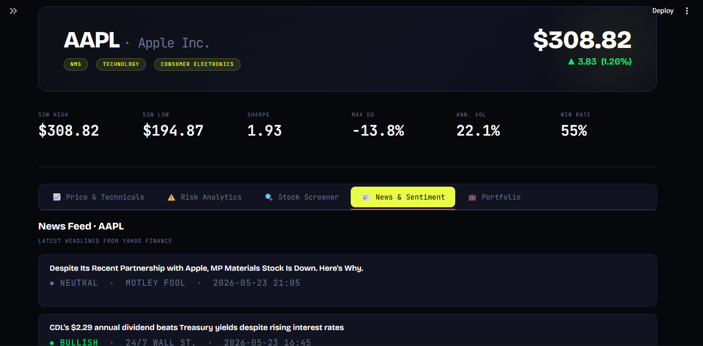

# ⚡ AlphaLens — Financial Research Platform



[](https://python.org)
[](https://streamlit.io)
[](https://finance.yahoo.com)


A production-grade stock research and analysis dashboard built with Streamlit, Plotly, and Yahoo Finance.

---

## 🚀 Features

| Module | What it does |
|--------|-------------|
| **Price & Technicals** | Candlestick chart, MA 20/50/200, Bollinger Bands, MACD, RSI, ATR, OBV |
| **Risk Analytics** | Sharpe, Sortino, Calmar, Max Drawdown, VaR/CVaR, Beta vs benchmark, rolling Sharpe, drawdown chart |
| **Stock Screener** | Side-by-side comparison table, normalised cumulative returns, correlation heatmap |
| **News & Sentiment** | Live headlines, keyword-based Bull/Bear/Neutral scoring, sentiment donut chart |
| **Portfolio Tracker** | Holdings P&L, portfolio value over time, allocation pie chart |

---

## 🛠️ Setup & Run

```bash
# 1. Clone / download the project folder

# 2. Install dependencies
pip install -r requirements.txt

# 3. Run the app
streamlit run app.py
```

The dashboard opens at `http://localhost:8501`

---

## 📂 Project Structure

```
finance_research/
├── app.py              # Main Streamlit application
├── requirements.txt    # Python dependencies
└── README.md           # This file
```

---

## 🎛️ Usage

### Sidebar Controls
- **Primary Ticker** — Main stock to analyse (e.g. `AAPL`)
- **Benchmark** — Compare against an index (e.g. `SPY`, `QQQ`)
- **Compare Tickers** — Comma-separated list for the screener (e.g. `MSFT, GOOGL`)
- **Date Range** — Quick presets (1M, 3M, 6M, 1Y, 2Y, 5Y) or custom
- **Portfolio Holdings** — Enter as `TICKER:SHARES` (one per line)
- **Chart Overlays** — Toggle MA, Bollinger Bands, volume bars

### Portfolio Input Format
```
AAPL:10
MSFT:5
TSLA:3
GOOGL:2
```

---

## 📊 Technical Indicators

| Indicator | Parameters |
|-----------|-----------|
| Simple Moving Average | 20, 50, 200 days |
| Bollinger Bands | 20-day, 2σ |
| RSI | 14-period |
| MACD | 12, 26, 9 EMA |
| ATR | 14-period |
| OBV | Cumulative |

---

## ⚠️ Disclaimer

This dashboard is built for **educational and research purposes only**. It does not constitute financial advice. Always do your own due diligence before making investment decisions.

---

## 🧰 Tech Stack

- **Streamlit** — UI framework
- **yFinance** — Market data
- **Plotly** — Interactive charts
- **Pandas / NumPy** — Data processing
